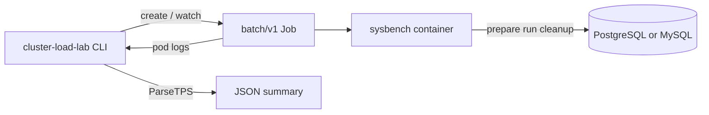
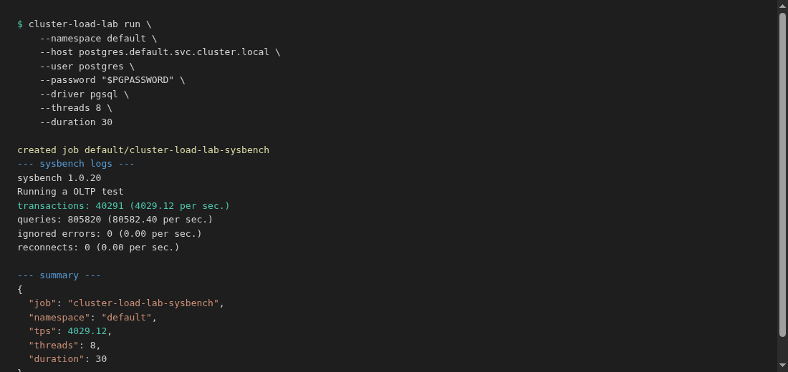

# cluster-load-lab

[](https://go.dev/)
[](LICENSE)
[](https://kubernetes.io/)

**cluster-load-lab** is a standalone **Go CLI** for any Kubernetes cluster. It generates or runs **batch/v1 Jobs** that execute **sysbench** `oltp_read_write` against **PostgreSQL** or **MySQL**, then parses **TPS** from pod logs for a quick sanity check before you promote a database change.

---

## Why this project

Teams often need a fast answer after standing up PostgreSQL or MySQL in a dev cluster:

> Does this baseline look healthy before we move to staging?

Without a tool you end up debugging pods, installing sysbench by hand, and copying connection strings. **cluster-load-lab** wraps that into two commands: **`manifest`** (print YAML) and **`run`** (create Job, wait, print JSON summary).

---

## Architecture



| Piece | Role |
|-------|------|
| `cmd/cluster-load-lab` | CLI: `manifest`, `run` |
| `pkg/bench` | Build Job spec (sysbench flags, resources, TTL) |
| `pkg/runner` | Kubernetes client: create Job, poll, fetch logs, parse TPS |
| `manifests/` | Hand-edited examples for PostgreSQL and MySQL |

Each run is a **single ephemeral Job**: prepare schema, run workload, cleanup, auto-expire with `ttlSecondsAfterFinished`.

---

## Example output



---

## Features

- **PostgreSQL and MySQL** via `--driver pgsql|mysql`
- **manifest** subcommand: render Job YAML without cluster access
- **run** subcommand: create Job, wait, stream logs, emit JSON summary
- **TPS parsing** from sysbench `transactions:` line
- Sensible defaults: 8 threads, 30s run, 4 tables, 10k rows each
- Default Job image: `ubuntu:24.04` (installs sysbench at runtime; supports PostgreSQL SCRAM and MySQL)
- Optional pre-built image: `docker build -t cluster-load-lab-sysbench:0.1.0 docker/sysbench`

---

## Quick start

**Requirements:** Go 1.22+, kubectl context with permission to create Jobs, database reachable from worker nodes.

```bash
git clone https://github.com/Jay2006sawant/cluster-load-lab.git
cd cluster-load-lab

go mod tidy
make build

# Print Job YAML (no cluster needed)
./bin/cluster-load-lab manifest \
  --namespace default \
  --host postgres.default.svc.cluster.local \
  --user postgres \
  --driver pgsql \
  --threads 8 \
  --duration 30

# Create Job and wait for results
./bin/cluster-load-lab run \
  --namespace default \
  --host postgres.default.svc.cluster.local \
  --user postgres \
  --password "$PGPASSWORD" \
  --driver pgsql
```

### MySQL example

```bash
./bin/cluster-load-lab run \
  --namespace default \
  --host mysql.default.svc.cluster.local \
  --user root \
  --password "$MYSQL_PASSWORD" \
  --driver mysql \
  --database sbtest
```

### CI usage

Use `run` in a pipeline after deploy; check exit code and parse the JSON summary block:

```bash
./bin/cluster-load-lab run ... 2>&1 | tee load.log
grep -q '"tps"' load.log
```

---

## Static manifests

Edit placeholders and apply directly:

```bash
kubectl apply -f manifests/sysbench-postgresql.yaml
kubectl logs -n everest job/cluster-load-lab-sysbench -f
```

MySQL template: [`manifests/sysbench-mysql.yaml`](manifests/sysbench-mysql.yaml)

Helper script with env vars: [`examples/render-manifest.sh`](examples/render-manifest.sh)

---

## CLI reference

```
cluster-load-lab manifest [flags]   Print Job YAML to stdout
cluster-load-lab run [flags]        Create Job, wait, print logs + JSON summary
```

| Flag | Default | Description |
|------|---------|-------------|
| `--namespace` | `default` | Job namespace |
| `--name` | `cluster-load-lab-sysbench` | Job name |
| `--host` | (required) | Database Service host |
| `--port` | 5432 / 3306 | Database port |
| `--user` | (required) | Database user |
| `--password` | | Required for `run` |
| `--database` | `postgres` / `sbtest` | Database name |
| `--driver` | `pgsql` | `pgsql` or `mysql` |
| `--threads` | `8` | sysbench threads |
| `--duration` | `30` | Run time in seconds |
| `--kubeconfig` | | Path to kubeconfig |

---

## Project layout

```
cluster-load-lab/
├── cmd/cluster-load-lab/   # CLI entrypoint
├── pkg/bench/              # Job builder
├── pkg/runner/             # Kubernetes + TPS parser
├── manifests/              # Example Job YAML
├── examples/               # render-manifest.sh
└── docs/screenshots/       # README visuals
```

---

## Tests

```bash
make test
```

Covers Job spec generation (PostgreSQL/MySQL passwords), and sysbench log TPS parsing.

---

## License

Apache 2.0. See [LICENSE](LICENSE).
